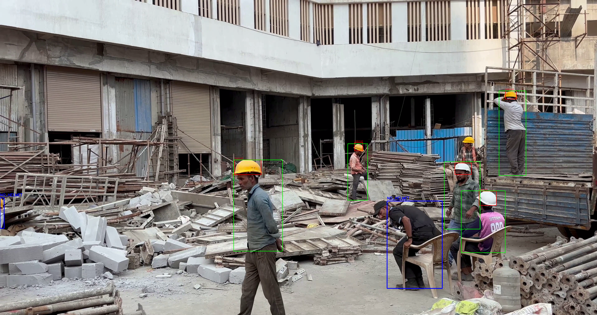

# HelmetGuard: Safety Helmet Detection System 👷‍♂️🤖

## 📌 Overview
HelmetGuard is an end-to-end computer vision project built to automatically detect whether construction workers are wearing safety helmets. If a person is detected without a helmet, the system flags them with a `NO_HELMET` warning bounding box.

## 🚀 Tech Stack
* **Computer Vision:** YOLOv8 (Ultralytics)
* **Image Processing:** OpenCV
* **Language:** Python
* **Hardware:** NVIDIA GeForce RTX 4060 Laptop GPU

## 🧠 Approach & Workflow
1.  **Data Collection & Annotation:** Manually annotated a custom dataset of 51 images using Roboflow.
2.  **Model Training:** Trained YOLOv8 Nano (`yolov8n.pt`) for 100 epochs, achieving a highly converged loss curve.
3.  **Logic Integration:** Developed a custom Python script that utilizes geometrical overlap logic (checking if a helmet bounding box intersects with the top 1/3 of a person's bounding box) to determine safety compliance.

**Note on Accuracy:** Since the current dataset consists of approximately 50 images, the precision is at a "Proof of Concept" stage. However, the **detection logic is fully functional**. Performance can be significantly improved by expanding the dataset or applying further Data Augmentation techniques.

## 📂 Project Structure
The project is organized into two main notebooks:
* **`test.ipynb`**: Handles dataset downloading, environment setup, and the YOLOv8 training process.
* **`run.ipynb`**: Implements the core `NO_HELMET` detection logic, processing both images and video files.

## 🎬 Demo

### Video

